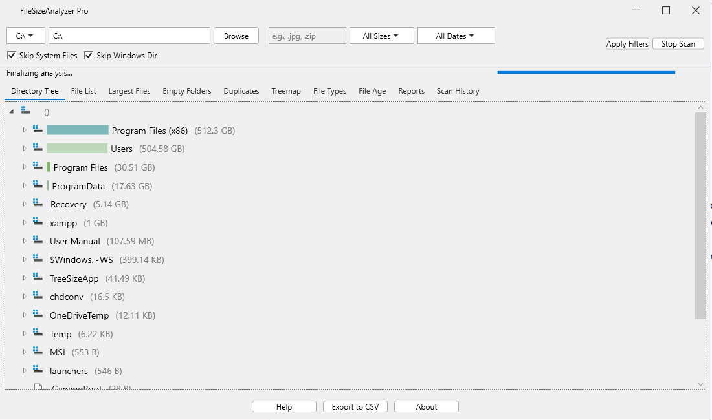

# FileSizeAnalyzer Pro

## Overview
FileSizeAnalyzer Pro is a powerful and modern Windows utility for analyzing disk space usage. Built with WPF and C#, it provides a fast, asynchronous scanning engine and a rich set of tools to help you understand, visualize, and manage your files.  
It features a clean, theme-aware UI inspired by modern development tools, making it both functional and pleasant to use.

## Features

### 🚀 High-Performance Scanning
- Multi-threaded, asynchronous scanning engine.
- Quickly analyzes directories without freezing the UI.

### 🎨 Modern UI
- Sleek, theme-aware interface that adapts to your Windows settings (Light/Dark).
- Custom title bar and styled controls for a professional feel.

### ☁️ OneDrive Aware
- Safely scans OneDrive folders with "Files On-Demand" enabled.
- Reads file metadata without triggering downloads of cloud-only files.

### 🗂 Interactive Directory Tree
- Hierarchical view of your file system.
- Visual size bars for quick understanding of space usage.
- Automatically sorts contents by size.

### 📊 Advanced Analysis Tabs
- **File List**: Filterable list of all scanned files.
- **Largest Files**: View top 100 largest files instantly.
- **Empty Folders**: Locate and remove clutter.
- **Grouped Duplicates**: Identify and delete redundant files via TreeView.
- **Treemap Visualization**: Interactive layout showing size proportionally.
- **File Types & Age**: Summary reports by extension and modification date.
- **Scan History**: Access logs of previous scans.

### 🔍 Powerful Filtering
- Filter by:
  - File size
  - Date range (including custom)
  - Multiple extensions (e.g., .jpg, .zip, .log)
- Skip system files and the main Windows directory for faster, more relevant scans.

### 🧰 File Management
- Right-click context menu for files/folders.
- Move to Recycle Bin safely.
- Open Containing Folder in Explorer.

### 📤 Export & 📘 Help
- Export filtered lists to .csv.
- Built-in Help and About dialogs.

## 🛠 Tech Stack
- **Framework**: .NET 9.0
- **UI**: Windows Presentation Foundation (WPF)
- **Language**: C#

### Core Libraries
- **System.IO.Hashing** – Fast file hashing (XxHash64)
- **Microsoft.VisualBasic** – Safe Recycle Bin operations

## 🚀 How to Use
1. Clone the repository.
2. Open `FileSizeAnalyzerGUI.sln` in Visual Studio.
3. Ensure .NET 9.0 SDK is installed.
4. Build and run the application.

## 🔮 Future Development Ideas
- Interactive Pie Chart for the File Types tab.
- Save/Load Scans for persistent scan sessions.
- Bulk Actions in file grids.
- Windows Explorer Integration:
  - Right-click > Scan with FileSizeAnalyzer
